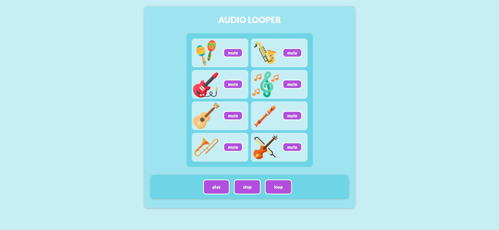

# Loop-machine

this app is a frond-end project which implements a loop machine. The loop machine has 8 diffrent channels , 
each channel represent a diffrent audio track. 
The loop machine has 3 buttons  - play , stop & loop , this buttons allow the user to manifulate the sound track . 
PLAY - once clicked all of the diffrent sound will start at once (the ones who are not muted)
STOP - once clicked will stop immediatly the sounds that are playing and will reset them (each and every one
to the start of his sound)
LOOP - once clicked the un-muted sounds that are playing will keep on playing over and over until it is clicked again or until stop will be clicked .
In addition , every channel has a mute button , once clicked the sound is muted . 

### To run the app, please enter the following commands in this order:

```sh
    1. npm i
    2. npm start
```

Demo: https://flamboyant-lumiere-3a8fed.netlify.app

## Screenshot

<p align="center"></p>

## Tech stack
1. HTML
2. CSS
3. REACT
